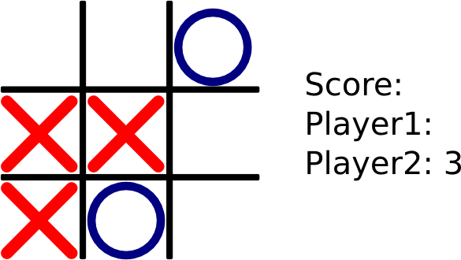

#Design Report

This report contains the intended structure of the Bonnie Tyler Fan Club's web-based TicTacToe implementation. The goal of this report is to give a good idea of the system will look and aid in it's implementation.

##Prototype
This is a simple drawing of our intended graphical interface. We ended up using the same graphical assets for the actual interface so it is eerily cloese to the actual result.

##Coding rules

###General
* Thorough and descriptive comments are MANDATORY. This is extremely improtant for other people to be able to , which is even further incentive for doing this properly. 
* All functions should have a small comment describing what they do above them and all conditional logic should be explained.

###Java
* The code in this project will use the Camel Case naming convention. This is what all java libraries use and we see no good reason to deviate from this well established convention.
* Costant names will be written in all-caps
* We will use the Allman style indent Style. This is what we found to be the personal preference of all our team members.
* Indents will consist of 4 spaces. This is simply what most editors defaut to and we again see no reason to deviate from well established traditions

####Sample code
	//Check if a number is 5 or 6 and if so return it, else return 0
	public int foo(int argument)
	{
		//If our argument is either 5 or 6 return our value
		if(argument == 5 || argument == 6)
		{
			return argument;
		}
		//If not we aren't intererested in the number and just return 0
		else
		{
			return 0;
		}
	}

###HTML
* All tags shall be in lower case
* All tags shall be closed properly
* All references to CSS and Javascript should be in the head of the document. Such code should not be found within the document.
* We will be using the html5 standard

####Sample code
	<!DOCTYPE html>
	<html lang="en" xmlns="http://www.w3.org/1999/xhtml">
		<head>
			<meta charset="utf-8" />
			<title>Title</title>
			<link rel="stylesheet" type="text/css" href="style.css">
			
		</head>
		<body>
			<!--This is a fairly useless web page-->
			
This is a paragraph

		</body>
	</html>

###Javascript
The same rules that apply to Java apply without exception to javascript code.

##Class diagram
This is the class diagram we came up with for this project.

###Class description
The following is a short description of the role of each of our classes.

* TicTacToe: Contains the main logic of our program

* Board: Represents the board a game of TicTacToe is played on, contains operations for altering it

* Player(interface): Represents a player that plays the game

* HumanPlayer: A human player, Reads human input

* ComputerPlayer: A computer player
